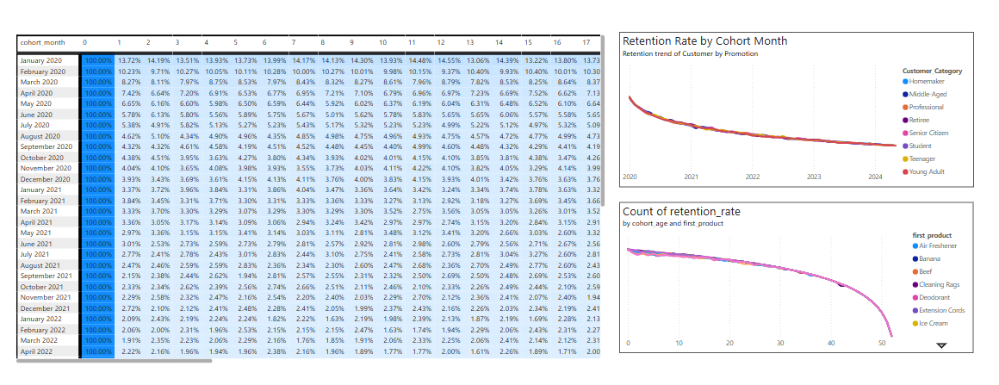

# 📊 Customer Retention & Repeat Purchase Analysis

## 🧩 Problem Statement

We observed a significant decline in customer retention rates over the past two quarters—especially among new customers acquired via online promotions. Many users are making only a single purchase and never returning. This project aims to identify **which customers are churning, why they're leaving, and how to retain them.**

---

## 🛠️ Tools & Technologies Used

- **Python / Pandas / NumPy** – For cohort analysis and data wrangling
- **Power BI / Tableau** – For visualization of retention trends
- **Jupyter Notebooks** – For step-by-step EDA and cohort-based retention analysis
- **Excel** – Lightweight validation and filtering
- **SQL** – For querying transactional and customer behavior data

---

## 🌟 North Star Metric

**Customer Retention Rate (CRR)**  
_The percentage of customers who continue purchasing after their first transaction._

### 🎯 Key Drivers of Retention:

| Driver                          | Influence                                                 |
|-------------------------------|------------------------------------------------------------|
| **Promotion Type**             | Discount vs BOGO showed no significant retention impact    |
| **First Purchase Experience**  | Heavily influences drop-off by Month 1                    |
| **Product Type**               | Popular grocery items show poor long-term retention        |
| **Customer Segment**           | Professionals and Retirees retain better than Young Adults |
| **Timing / Seasonality**       | Holiday cohorts churn faster post-season                  |

---

## 🚨 Observed Patterns & Insights

### 1. ⚠️ Retention Drop After First Purchase
- ~90% customers churn after Month 1
- Plateau around 5–15% after Month 2

### 2. ⚙️ No Impact of Promotion Types
- Retention similar across discount, BOGO, and no-promo cohorts

### 3. 🛒 Product Loyalty Is Weak
- Even essentials (e.g., soap, toothpaste) fail to encourage repeat purchases

### 4. 👥 Segment Behavior
- **Professionals & Retirees** show better retention
- **Young Adults** have highest volatility and churn

### 5. 📉 Post-2020 Cohorts Underperform
- Retention and revenue weaker in 2021–2024 vs 2020

### 6. 🎄 Seasonal Buyers Don’t Return
- High churn in Nov–Dec acquisition cohorts

---

## 🔍 Possible Root Causes

| Area                          | Possible Causes                                                                 |
|------------------------------|----------------------------------------------------------------------------------|
| Early Churn                  | No onboarding, weak post-purchase follow-up                                     |
| Promo Ineffectiveness       | Attracting price-sensitive customers with no brand loyalty                      |
| Low Product Stickiness       | Commoditized items, easy substitutes, no bundling or incentives                 |
| Segment-Based Drop-Off       | Young Adults less brand loyal, less responsive to basic engagement              |
| Seasonal Churn               | Deal-hunters with no incentive to return post-holiday                           |
| Platform Trust Decline       | UI/UX degradation, fulfillment issues post-2020                                 |

---

## 🧠 Strategic Considerations

- Avoid a “one-size-fits-all” promotion model—segment-based targeting is key.
- Don’t rely on product popularity alone—build behavior-driven re-engagement.
- Use **bundles, loyalty rewards**, and **gamification** for essentials.
- Monitor **cohort health** by time period, promo type, and lifecycle stage.
- Focus retention spend on **mid-churn-risk segments** like Retirees and Professionals.

---

## ✅ Recommendations

| Strategy Area          | Recommendation                                                                 |
|------------------------|----------------------------------------------------------------------------------|
| 🚀 First Purchase Flow  | Add onboarding touchpoints post-purchase; automate follow-up within 7 days     |
| 🎁 Promotions          | Shift to personalized, milestone-driven offers (e.g., "3rd order = cashback")   |
| 📦 Bundling            | Create recurring value packs for essentials + add refill reminders              |
| 👥 Segment Targeting    | Build tailored offers for Professionals & Retirees; test gamified programs     |
| 📆 Seasonal Buyers      | Use festive buyers’ data for targeted re-engagement before next season         |
| 🔍 Post-2020 Changes    | Reassess fulfillment & app experience quality; reintroduce review incentives   |

---

## 📂 Folder Structure

